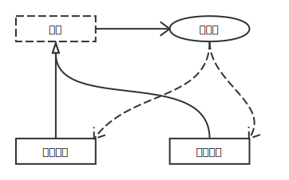
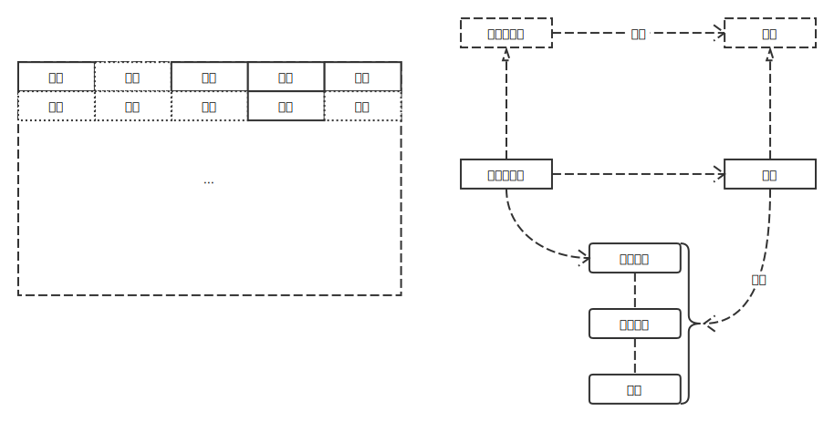
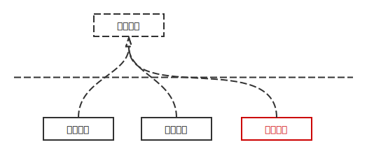
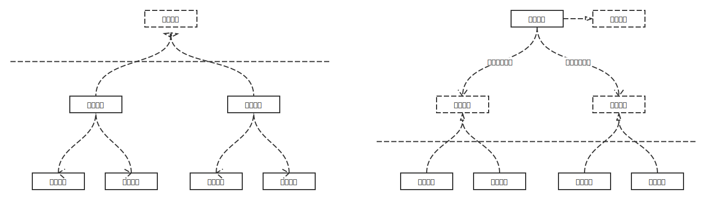
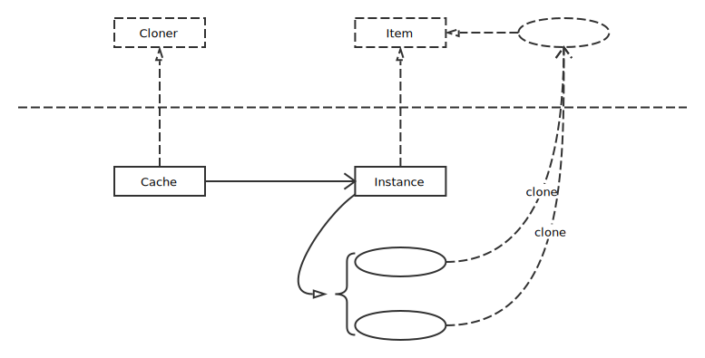

# Creational Patterns

## Singleton Pattern

单例模式非常容易理解，就是只会创建一个对象实例不会重复。单例模式下，只有第一次会创建实例，之后都是创建的对象都指向第一次创建的实例。

单例模式的目的：

* 需要一个单一的、共享的对象实例
* 限制对象实例在整个程序运行过程中只创建一次

例如，在每个手机里只有一个扬声器，所以在系统运行时应该只存在一个扬声器实例供其他应用使用。我们考虑一下场景，在打电话时，我们是无法使用使用音乐软件听音乐，所以在这里使用单例模式非常合适。

## Builder Pattern

生成器模式主要用来创建流程一样的对象实例，它的核心在于创建流程一样（结构可以不一样）。

生成器模式的目的：

* 将复杂的创建过程抽象出来，让对象使用者与对象的创建过程分离开
* 通过一步一步填充字段和创建内嵌的对象创建出复杂的对象
* 让多个结构、创建过程相同的对象共用一个创建对象的算法

例如，要生成一张迷宫地图，在生成时无论是在 `设置高墙、设置通道、设置高墙...` 还是 `设置通道、设置高墙、设置高墙...` 等等，它们创建对象实例的流程都一样，这时我们可以采用生成器模式。

## Factory Pattern

工厂模式用来创建复杂的实例，当实例非常复杂且使用者不需要知道实例创建过程和其方法的具体实现时，可以使用工厂模式将实例封装成一个接口。

工厂模式的目的：

* 将接口的实现拆分到不同的地方，而使用者通过接口就可以创建相应对象实例
* 在接口层工作，而不是具体实现，即使用者只需知道接口的使用方法不需要知道其内部实现
* 将功能相同的对象分组，获得这一组对象的创建器

例如，有一个生产鼠标的工厂，这时有戴尔和惠普两种鼠标，都实现了鼠标工厂的接口，使用者就可以通过鼠标工厂创建相应的鼠标。一段时间后，我们需要创建华硕鼠标，这时我们让华硕鼠标实现鼠标工厂的接口，使用者也可以使用鼠标工厂创建华硕鼠标。

## Abstract Factory Pattern

抽象工厂模式其实就是创建工厂的工厂。

抽象工厂模式的目的：

* 为工厂方法提供一层新的封装，所有的方法返回一个通用接口
* 将常见工厂组成一个大的工厂，我们可以通过大工厂得到内部的工厂

例如，有一个生成外设的工厂，这时有戴尔鼠标和惠普鼠标两种鼠标、戴尔键盘和惠普键盘两种键盘。第一种，让戴尔工厂和惠普工厂都实现外设工厂的方法，然后让他们分别制造自己的鼠标和键盘。第二种，让一个外设工厂实现外设工厂接口，让外设工厂创建鼠标工厂和键盘工厂，然后再在每个工厂下进行扩展，让鼠标工厂可以生产戴尔鼠标和惠普鼠标，让键盘工厂可以生产戴尔键盘和惠普键盘。

## Prototype Pattern

原型模式就是创建好标准的对象实例作为原型，当需要使用一个对象实例时，直接将相应的原型深度复制一份就可以使用了。

原型模式的目的：

* 维护一组用于被克隆的对象实例
* 在创建时为对象提供某些默认值
* 如果创建过程很复杂，可以释放创建时所需的 CPU、内存资源

