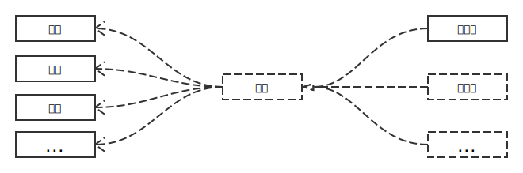

# Structural Patterns

## Composite Pattern

组合模式可以展现两个或多个结构之间的关系。在 Go 中对象间没有继承关系

## Adapter Pattern

适配器模式

## Bridge Pattern

桥接模式将一个抽象与实现解耦，把事物对象和其具体行为、具体特征分离开来，使它们可以各自独立的变化。

例如：电力网络抽象给我们使用的简单来说就是一个供电插座，我们可以使用它来给电视供电、给空调供电、给手机充电等等，而其内部可能火电厂在发电也可能是风力在发电。在这中间的一层抽象就将提供电能的具体行为、具体特征分离开来，外部和内部都能各自独立的变化。

在 Go 中，io.Reader 很好的将 Reader 的内部读取过程和外部使用分离开了。

## Reference

* https://en.wikipedia.org/wiki/Composite_pattern
* https://en.wikipedia.org/wiki/Adapter_pattern
* https://en.wikipedia.org/wiki/Bridge_pattern